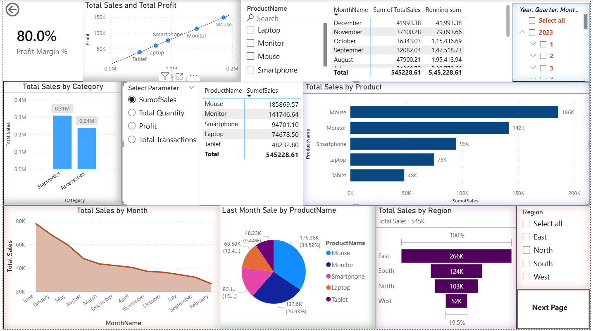
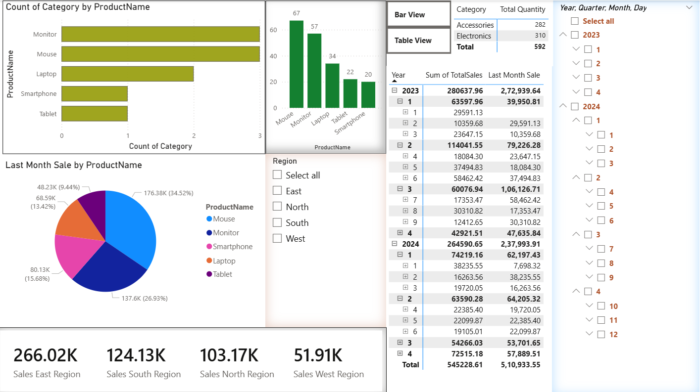

# 📊 PowerBI Sales Report & Data Transformation 

Hey there! 👋 Welcome to my PowerBI Data Analytics project. I took raw sales data, cleaned it up, engineered new features, and built an interactive dashboard to visually track key sales targets and trends.

Before diving into the technical details, check out the final interactive dashboard in action below!

### 🎬 See the Report in Action

*(Note: These high-quality dashboard GIFs may take a few seconds to load.)*

 

  
    
  

 

  
<b>🖼️ Click here to view static screenshots of the dashboard</b>

   
  
    
  
    
  

---

## 📈 The PowerBI Report (Features)

I designed this dashboard to make exploring the sales data as intuitive as possible. Here is a breakdown of the key features I implemented to bring the data to life:

* **🎯 Target KPIs (Key Performance Indicators):**
  I built custom KPI tracking to measure performance against specific goals. For example, I set a dynamic target of $40K—the visual automatically shifts to Green (target hit) or Red (target missed) based on current real-time sales.

* **🖱️ Interactive Toggles (Bookmarks & Action Buttons):**
  To save space and keep the dashboard looking clean, I used overlapping visuals. By linking Action Buttons to Bookmarks, you can click a button to seamlessly switch the view from a visual Bar Chart directly to a detailed Matrix table in the exact same spot!

* **🔍 Drill-Through for Detailed Insights:**
  Curious about a specific product segment? I set up Drill-Through pages. If you spot "Laptops" on the main page, you can simply right-click it and drill through directly to a separate, dedicated page breaking down that specific product's underlying stats and description.

* **🌳 Decomposition Trees:**
  I used Decomposition Trees to investigate the structural flow of our sales. It acts like a dynamic flowchart (e.g., breaking down *Product Category* ⮕ *Product Name* ⮕ *Unit Price*) to let the user easily investigate exactly where the biggest numbers are coming from.

* **📊 Smart Charting & Custom Grouping:**
  * **Line & Bar Charts:** I used a dedicated `Date` table to track time-based trends exactly (like viewing last quarter's total sales day-by-day).
  * **Data Groupings & Bins:** I categorized scattered data into logical groups. For instance, I grouped multiple scattered cities into "Tier 1" and "Tier 2" markets, and utilized grouping bins to create neat histogram slices.
  * **Tooltips:** I configured custom tooltips so when you hover your mouse over any bar or pie slice, a floating box appears with instant extra info.

* **🎛️ Dynamic Filtering:**
  I implemented a robust filter structure depending on the need: allowing users to filter inside a single visual box, filtering everything across a single page, or persisting filters globally across the whole report.

 

## Feature Extraction & Data Cleaning in Python (Pandas)

To do any proper data visualization or statistical analysis, we first need clean data. In the real world, datasets are rarely perfect. For this project, I used Python and the Pandas library to break down messy text and create useful new data columns.

### 1. The Problem: Hidden Data in a Single Column

When I first loaded the dataset (`anime.csv`), it only had three main columns: `Rank`, `Title`, and `Score`. However, I quickly noticed that the `Title` column contained a lot of hidden information crammed into one long string. 

For example, a single cell in the `Title` column looked like this:
`"Frieren: Beyond Journey's End (28 eps)\nTV\n\n2M members"`

It contained the episodes, the type of show, and the popularity, but they were trapped inside the text! I couldn't plot a graph using this text. I needed to extract the episode count, release dates, and member counts into their very own separate columns.

**Initial State:**
 

  

 

### 2. How I Extracted the Features Step-By-Step

Because the text was cut off in the normal Pandas view, I first used `pd.set_option('display.max_colwidth', None)` so I could see the entire string clearly and study the patterns. Once I understood the patterns, I wrote custom Python functions to extract exactly what I needed.

Here is a detailed breakdown of how I did it:

**A. Extracting the Episode Count**
* I noticed that the episode count was always trapped between a round bracket `(` and the word ` eps)`.
* I built a function using Python's `.find()` method to locate the exact position of `(` and the position of ` eps)`.
* Once I had those positions, I sliced the string to pull out just the number in between them.
* Finally, I converted that extracted text number into a proper integer (like `28`) so that I could perform math operations on it later.

**B. Extracting Release Dates (Start Month and Year)**
* Similar to the episodes, the broadcast date was hidden deep inside the string.
* After slicing out the rough date, it had annoying extra spaces wrapped around it. I used the `.strip()` method to clean off those trailing spaces.
* Since the month and year were separated by a single space (e.g., "Oct 2023"), I used the `.split(' ')` function to cut the string into two separate pieces.
* I saved the text "Oct" into a new `Start_Month` column, and I converted the "2023" into a proper number and stored it in a new `Start_Year` column.

**C. Automating the Process**
* Instead of running my functions one by one for every single row (which is very slow), I used Pandas' powerful `.apply()` feature. 
* This took my custom extraction functions and instantly ran them across every single title in the dataframe, generating thousands of clean data points in just a fraction of a second.

### 3. Exploring the Data (Statistical Analysis)

Once I had clean numerical columns, I could start actually asking questions about the data:

* **Finding Outliers:** I wrote simple logic to flag extremes in my data. I created a rule to identify "Hidden Gems" (anime that had an incredibly high score of over 9.0, but very few viewers) and "Hyped" shows (massive viewership, but low scores). 
* **Drawing a Trend Line:** I wanted to know: *Does being more popular mean an anime is better?* I used a mathematical tool called `numpy.polyfit` to draw a straight "line of best fit" through my data to see the general trend.
* **Creating a Heatmap:** I built a custom, color-coded grid (a Heatmap) using the `matplotlib.imshow` tool. This allowed me to easily see if the anime score and the member count were strongly related to each other at a single glance.

### 4. The Final Result

After writing out all my custom extraction logic, the messy dataset was totally transformed. Instead of a single unreadable block of text, I now had perfectly clean, separated columns ready for advanced analysis.

**Final Cleaned State:**
 

  

 

